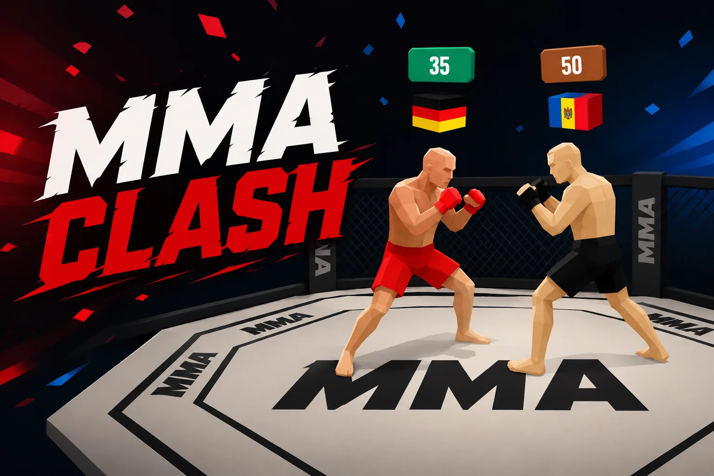
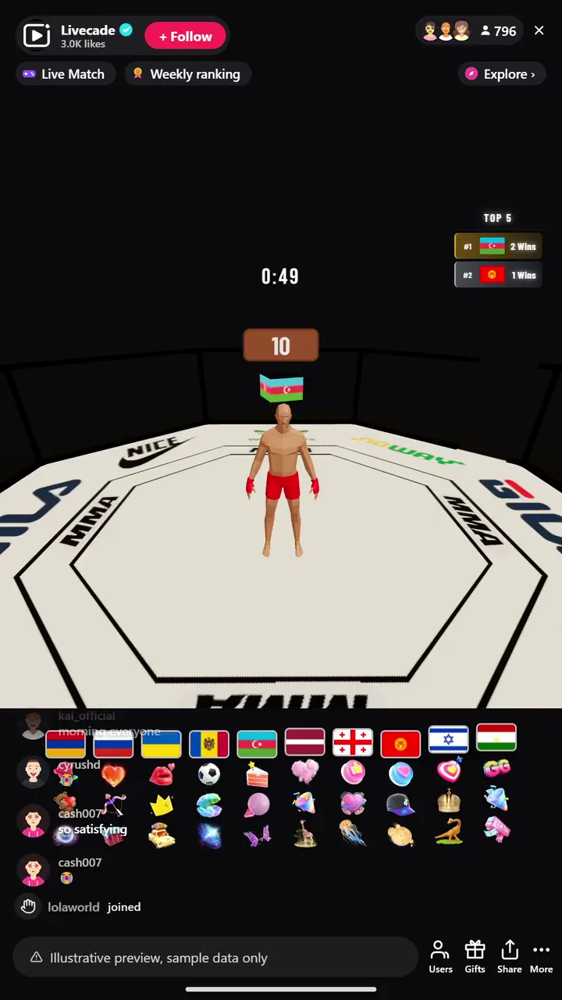

# MMA Clash - Interactive TikTok Live Game

> Your viewers fight for their country in a live arena.

Viewers spawn fighters representing their country and battle it out in a live arena. Gifts and comments trigger special moves, crowd reactions, and surprise events.

**[Play MMA Clash on Livecade](https://livecade.io/games/mma-clash/?utm_source=github&utm_medium=readme&utm_campaign=mma-clash)** - runs as a single browser source in OBS, Streamlabs, or TikTok LIVE Studio. Nothing for viewers to install.

## How viewers play

Viewers take part with the actions TikTok already gives them: **gifts**, **comments**, **likes**. Every action below is rebindable, so you decide which interaction drives which effect.

| Action | What it does |
| --- | --- |
| **Spawn fighter (per country)** | Adds a fighter flying the chosen country flag to the arena |
| **Add HP** | Bigger gifts pump more HP into that country's fighter, up to the max cap you set |

## How it works

### Viewers pick a side

A gift or a chat command spawns a fighter carrying that viewer's country flag. The more people join, the bigger the brawl.

### Gifts fuel the fight

Bigger gifts land harder. Each tier hits with more force, triggers power moves, and swings the momentum of the arena.

### A country takes the win

Fighters brawl in real time while the crowd rallies behind their flag. The last nation standing wins the round and the shoutout.

## About the game

MMA Clash turns your audience into a coliseum. Every viewer who sends a gift or types a command spawns a fighter flying their country flag, and the fighters brawl in real time while the crowd goes wild.

### Gifts swing the momentum

Special gifts trigger power moves, knockdowns and arena-wide effects, so no two fights play out the same way.

## What it looks like on stream

[Watch MMA Clash gameplay](https://cdn.livecade.io/games/mma-clash.mp4)

## What you can configure

- **Round duration** - Timed rounds or set to infinite
- **HP per gift coin** - How much each coin of a gift is worth
- **Max HP cap per fighter** - Ceiling so one whale can't run away with it
- **Leaderboard** - Show a live top-countries board, and how many entries
- **House fighter** - An always-present fighter for your country so the arena is never empty
- **Announcer taunts** - Automated hype callouts on an interval you choose
- **Background** - Transparent, a solid color, or your own image

## FAQ

<strong>How do viewers join MMA Clash?</strong>

Viewers join by sending a gift or typing a country command in your TikTok Live chat. Each one spawns a fighter flying that country's flag, so anyone watching can take part instantly using the chat they already use.

<strong>Do viewers need to send gifts to play?</strong>

No. Comments can spawn fighters too, so free viewers still join the action. Gifts add power moves and bigger swings, which is what drives gifting during the match.

<strong>Does MMA Clash work with any audience size?</strong>

Yes. The arena scales from a handful of viewers to a packed crowd, and more fighters just make the brawl bigger and more chaotic.

<strong>How do I add MMA Clash to my TikTok Live?</strong>

Add one browser source URL to OBS or your streaming software and go live. There is no plugin to install and no setup for your viewers.

## Setup

1. [Create a Livecade account](https://app.livecade.io/register?utm_source=github&utm_medium=cta&utm_campaign=mma-clash)
2. Copy your overlay browser source URL
3. Paste it into OBS, Streamlabs, or TikTok LIVE Studio
4. Pick MMA Clash, set your triggers, and go live

Runs in the browser, so it works on Windows and macOS with nothing to download. [See all TikTok Live games](https://livecade.io/tiktok-live-games/?utm_source=github&utm_medium=readme&utm_campaign=mma-clash).

---

_This repository documents MMA Clash, a hosted interactive game by [Livecade](https://livecade.io/?utm_source=github&utm_medium=footer&utm_campaign=mma-clash). The game runs on Livecade's platform, so there is no source to install here._
